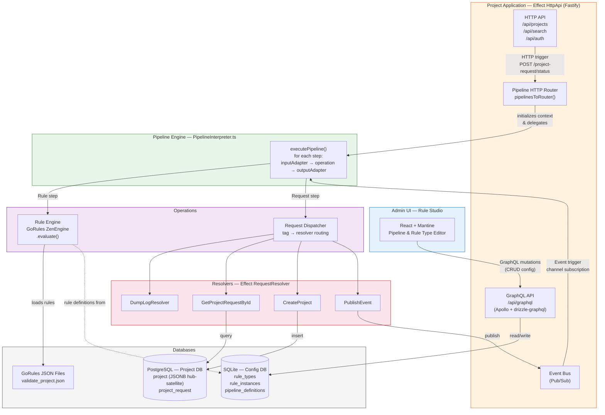

# Processing Pipeline

## Definition

A **Processing Pipeline** is a declarative, configurable workflow that orchestrates a sequence of operations in response to an external event. It decouples *what* triggers execution, *what* logic runs, and *how* data flows between steps — enabling administrators to compose complex business processes from predefined building blocks without writing code.

A pipeline:

1. **Reacts** to a trigger (HTTP request or event bus message)
2. **Initializes** a mutable context from the trigger payload
3. **Executes** an ordered sequence of steps, each reading from and writing to the context
4. **Returns** the final context as the pipeline result

## Core Concepts

| Concept | Description |
|---|---|
| **Trigger** | The event that starts the pipeline — either an HTTP endpoint or an event bus channel |
| **Context** | A mutable data bag initialized from the trigger payload, threaded through all steps |
| **Step** | A named unit of work: reads from context → executes an operation → writes back to context |
| **Operation** | The logic a step runs — either a **Rule** (GoRules decision) or a **Request** (resolver call) |
| **Input Adapter** | A mapping function `context → operationInput` — selects/reshapes what the operation receives |
| **Output Adapter** | A mapping function `(context, operationOutput) → newContext` — merges results back |

### Step Execution Model

```
context ──► inputAdapter ──► operation.execute() ──► outputAdapter ──► context'
```

Each step is executed sequentially. The output adapter is optional — if omitted, the context passes through unchanged (fire-and-forget step).

## Assumptions & Preconditions

| # | Assumption | Detail |
|---|---|---|
| 1 | **Rules are predefined** | Rule types (schema definitions) and rule instances (GoRules JSON) are stored in the database (`rule_types`, `rule_instances` tables) and managed via the Rule Studio UI |
| 2 | **HTTP and event triggers are predefined** | The set of available endpoints and event bus channels is declared at the application level; pipelines bind to them by reference |
| 3 | **Requests/resolvers are predefined** | Each resolver (e.g. `GetProjectRequestById`, `CreateProject`, `DumpLog`) is implemented in code and registered in the `RequestDispatcher` |
| 4 | **Adapters use declarative mappings** | Input/output adapters are expressed as serializable data-mapping expressions (not arbitrary code), enabling storage in the database |
| 5 | **Steps execute sequentially** | No parallel branching — steps run in order within a single context |

## Pipeline Definition Schema

```typescript
PipelineDefinition {
  id: string                    // unique identifier
  trigger: HttpTrigger | EventBusTrigger
  steps: PipelineStep[]
}

PipelineStep {
  name: string                  // human-readable step name
  operation: RuleOperation | RequestOperation
  inputAdapter: Mapping         // context → operation input
  outputAdapter?: Mapping       // (context, output) → new context
  condition?: Expression        // optional guard — skip step if false
}

HttpTrigger {
  type: "http"
  method: "POST" | "GET" | "PUT" | "DELETE"
  path: string
  payloadSchema: Schema
}

EventBusTrigger {
  type: "event_bus"
  channel: string
  payloadSchema: Schema
  filter?: Predicate
}

RuleOperation {
  type: "Rule"
  ruleName: string              // references a rule_instances entry
  ruleFile: string              // GoRules JSON filename
  inputSchema: Schema
  outputSchema: Schema
}

RequestOperation {
  type: "Request"
  request: RequestTag           // references a registered resolver
}
```

## Examples

### Example 1 — Project Validation Pipeline

**Goal:** When a project request is submitted via HTTP, validate it against business rules and publish the result to the event bus.

| Property | Value |
|---|---|
| **ID** | `project-validation-pipeline` |
| **Trigger** | `POST /project-request/status` with `ProjectRequest` payload |
| **Context init** | `{ id, name, budget, cost }` from request body |

| # | Step | Operation | Input Adapter | Output Adapter |
|---|---|---|---|---|
| 1 | validateProject | Rule: `validate_project.json` | `ctx → ctx` (passthrough) | `(ctx, out) → { ...ctx, status: out }` |
| 2 | publishValidation | Request: `PublishEvent` | `ctx → { channel: "project.validation.events", payload: ctx.status }` | — (fire-and-forget) |

**Result:** Context contains the original request plus `status` (valid or list of issues).

### Example 2 — Project Creation Pipeline

**Goal:** When a valid project event is received, fetch the original request, prepare it, and create the project entity.

| Property | Value |
|---|---|
| **ID** | `project-creation-pipeline` |
| **Trigger** | Event bus `project.validation.events`, filtered to `ProjectValidStatus` only |
| **Context init** | `{ id }` from event payload |

| # | Step | Operation | Input Adapter | Output Adapter |
|---|---|---|---|---|
| 1 | fetchProjectRequest | Request: `GetProjectRequestById` | `ctx → { id: ctx.id }` | `(ctx, out) → { ...ctx, project: out }` |
| 2 | prepareProject | Rule: `prepare_project_creation.json` | `ctx → { project: ctx.project }` | `(ctx, out) → { ...ctx, form: out }` |
| 3 | createProjectEntity | Request: `CreateProject` | `ctx → { projectForm: ctx.form }` | — (terminal step) |

**Result:** A new project entity is persisted in the database.

## Architecture



### Component Responsibilities

| Component | Technology | Responsibility |
|---|---|---|
| **Admin UI (Rule Studio)** | React + Mantine + TanStack Router | Pipeline & rule type configuration through the frontend |
| **Configuration Module** | GraphQL API (Apollo + drizzle-graphql) | CRUD operations on pipeline and rule type definitions |
| **Configuration Database** | SQLite (Drizzle ORM) | Stores `rule_types`, `rule_instances`, and pipeline definitions |
| **Pipeline Engine** | Effect TS (`PipelineInterpreter.ts`) | Reads pipeline config, executes steps sequentially, manages context |
| **Rule Engine** | GoRules ZenEngine | Evaluates business rules from JSON decision tables |
| **Request Dispatcher** | Effect `RequestResolver` | Routes tagged requests to the correct resolver implementation |
| **Resolvers** | Effect services | Concrete implementations: DB queries, external API calls, event publishing |
| **Project Application** | Effect HttpApi (Fastify) | The host application exposing HTTP endpoints and event bus |
| **Project Database** | PostgreSQL (JSONB hub-satellite) | Stores project entities and related business data |
